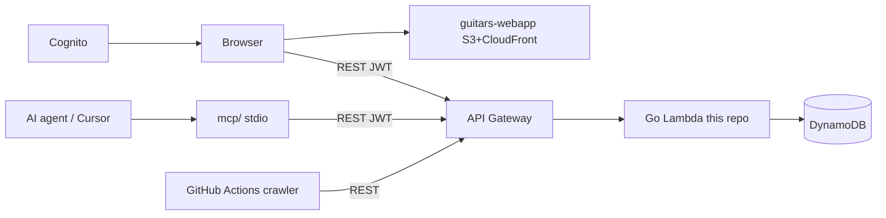
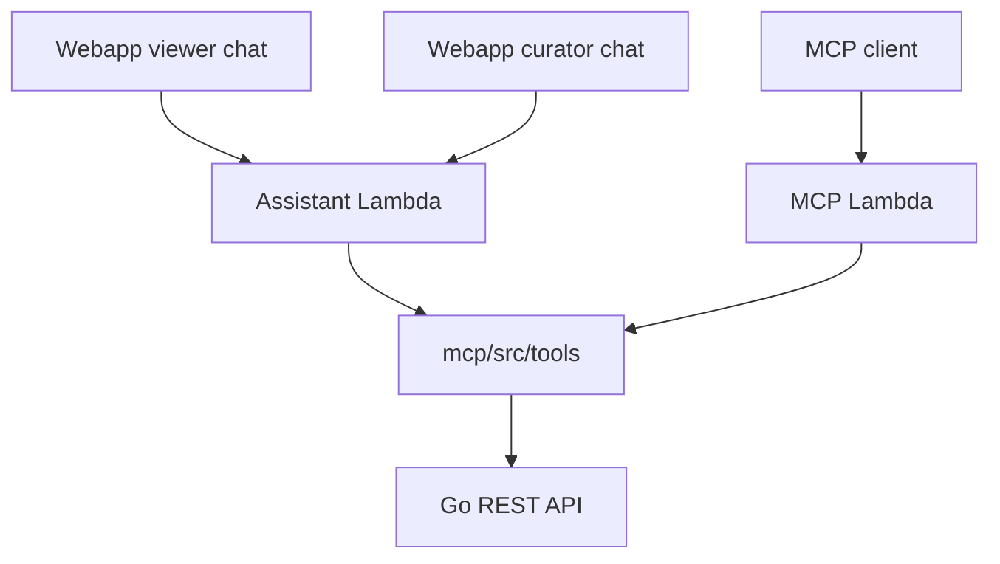

# Architecture

## System overview



| Component | Repo | Hosting |
|-----------|------|---------|
| **GuitarCollection API** | `wbits/guitars` (this repo) | API Gateway + Lambda |
| **Market crawler** | this repo | GitHub Actions (weekly) |
| **MCP server (Phase 1)** | this repo `mcp/` | Local stdio process |
| **Webapp** | `wbits/guitars-webapp` | S3 + CloudFront |

## API layout (DDD)

```
cmd/lambda/                       # Lambda entry
internal/guitarcollection/
    domain/                       # Guitar aggregate, invariants
    application/                  # use cases
    infrastructure/               # DynamoDB, Cognito auth, S3 presign
    interfaces/http/              # API Gateway adapter
cmd/crawler/                      # market crawl CLI
internal/marketcrawler/           # Reverb, eBay, Marktplaats sources
internal/userprofile/             # profiles, marketCrawlEnabled
mcp/                              # MCP stdio adapter (Node)
template.yaml                     # SAM stack
```

Domain invariants live in Go (`internal/guitarcollection/domain/guitar.go`). MCP uses a zod mirror at `mcp/src/contracts/guitar.ts` — keep aligned when payloads change.

## Storage

- **Guitars** — DynamoDB table keyed by `id`
- **Market logs** — separate DynamoDB table
- **Pictures** — S3 + CDN (presigned upload via API)

## Authentication

Production: **Amazon Cognito** JWT bearer tokens. The API maps token `sub` to collection ownership. Admins are in Cognito group `guitars-admins` (`isAdmin` on `GET /me`).

Local: bearer token via Secrets Manager (LocalStack) or legacy shared token for dev.

## MCP

| Phase | Where | Transport |
|-------|-------|-----------|
| **1 (done)** | `mcp/` in this repo | stdio → REST API — [`mcp/README.md`](../../mcp/README.md) |
| **2 (planned)** | New Lambda + `/mcp` route | Streamable HTTP — [plans/mcp-server.md](plans/mcp-server.md) |

## guitars-assistant (planned)

End-user AI with two capability profiles sharing `mcp/src/tools/`:

| Profile | Audience | Surface | Instructions |
|---------|----------|---------|--------------|
| **viewer** | Collection browsers | Webapp chat on `/collections/{userId}` | [assistants/viewer.md](assistants/viewer.md) |
| **curator** | Collection owners | Webapp owner chat + MCP clients | [assistants/curator.md](assistants/curator.md) |

Shared domain context: [assistants/shared.md](assistants/shared.md). Full plan: [plans/guitars-assistant.md](plans/guitars-assistant.md).



## Related documentation

| Topic | File |
|-------|------|
| HTTP API | [api-contract.md](api-contract.md) |
| Operations | [runbook.md](runbook.md) |
| guitars-assistant | [assistants/README.md](assistants/README.md), [plans/guitars-assistant.md](plans/guitars-assistant.md) |
| Webapp (React) | [guitars-webapp AGENTS.md](https://github.com/wbits/guitars-webapp/blob/master/AGENTS.md) |
