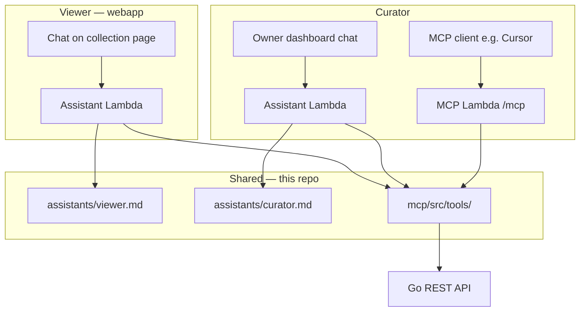

# guitars-assistant — implementation plan

> Product AI for guitars.com: **viewer** (read-only browsing) and **curator** (collection management). Instructions live in [`.agents/assistants/`](../assistants/).

## Architecture

One tool implementation (`mcp/src/tools/`); two **tool registries** (viewer vs curator) and two **system prompts**.

## Rollout phases

| Phase | Deliverable | Repo |
|-------|-------------|------|
| **A** | Instruction files + backlog (this plan) | `wbits/guitars` |
| **B** | `search_collection` tool + viewer read tools | `mcp/` |
| **C** | Webapp viewer chat + Assistant Lambda | `guitars-webapp` + API |
| **D** | Phase 2 hosted MCP (curator tools) | `wbits/guitars` — [mcp-server.md](mcp-server.md) |
| **E** | `research_guitar`, `presign_upload`; curator webapp chat | both |

## Gaps vs today

| Gap | Impact |
|-----|--------|
| No assistant Lambda or webapp chat | Viewers cannot use product yet |
| No `search_collection` | Filters work only by fetching full list + LLM filter |
| All API routes require auth | v1 viewer = logged-in user on public collection page; optional anonymous read later |
| `get_guitar` / market logs owner-scoped | Public read variants may be needed for viewer |
| No web-research tool | Curator “find documentation” flow blocked until Phase E |
| MCP has no system prompt | Clients must load `curator.md` via rule/skill or webapp loads at runtime |

## Safety

- **Viewer:** deny write/crawl tools at registration time; rate-limit per collection
- **Curator:** confirm before create/update/crawl; research tool is fetch-only until user approves write

## Related

- MCP Phase 2: [mcp-server.md](mcp-server.md)
- Backlog: [backlog.md](../backlog.md)
- Decisions: [decisions.md](../decisions.md) — guitars-assistant section
