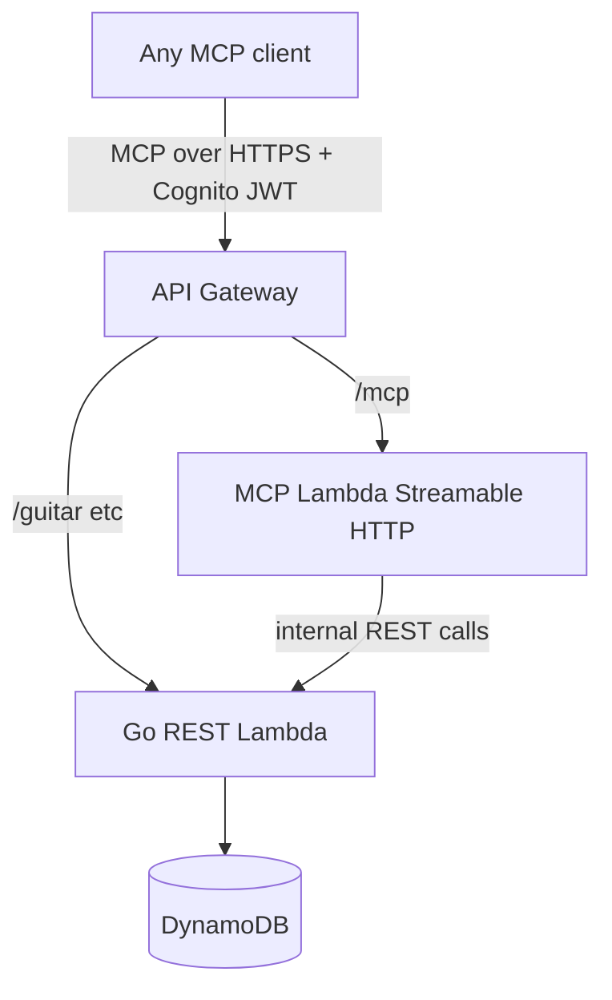

# MCP Phase 2 — hosted on API Gateway

> Phase 1 (local stdio in `mcp/`) is **done**. See [`mcp/README.md`](../../mcp/README.md) and [`.agents/backlog.md`](../backlog.md).

**Goal:** any guitars.com user with an account can connect an AI agent to their collection without a local MCP install.

## Target architecture



Gateway does not "become" MCP — it **routes to** a new MCP-capable handler. Existing REST routes stay for the webapp.

## What to build (this repo)

| Piece | Change |
|-------|--------|
| API Gateway | Route e.g. `POST /mcp` (Streamable HTTP) |
| Lambda | Node.js MCP Lambda; reuse tool logic from `mcp/src/` |
| Auth | Existing Cognito JWT authorizer |
| SAM | `template.yaml` updates |
| Go REST Lambda | Unchanged |

**Why a separate Node Lambda:** MCP SDK is mature in TypeScript; keeps protocol concerns isolated. Phase 1 handlers are transport-agnostic — only stdio → Streamable HTTP changes.

## Client configuration (sketch)

```json
{
  "mcpServers": {
    "guitars": {
      "url": "https://api.guitars.com/mcp",
      "headers": { "Authorization": "Bearer <cognito-id-token>" }
    }
  }
}
```

## Out of scope for Phase 2

- Cognito login flow inside MCP (clients use existing tokens)
- Replacing REST endpoints
- `POST /admin/market-crawl` (crawl stays GitHub Actions / CLI)

Track tasks in [`.agents/backlog.md`](../backlog.md).
